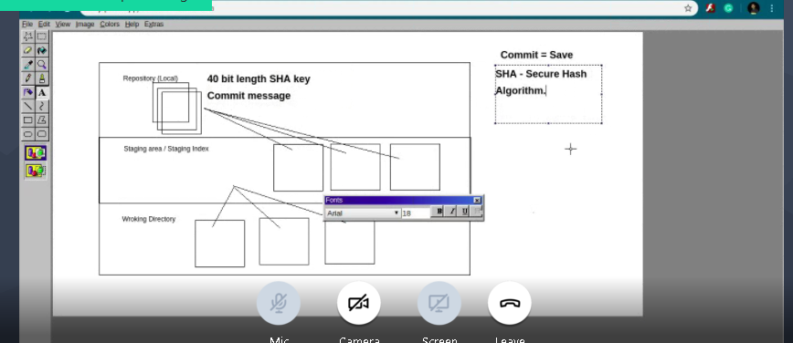

# APSSDC GIT CLASSES
## Git is a Distibutes Version Control System
### GitHub os Intersting
###### This is the smallest heading size

*Some text can be italic*<br>
**Some text can be bold**<br>
***some text can be bold and Italic***<br>
~~This is strike through text~~<br>

# Lists
## Unorder Lists
* Ul 1
* Ul 2
* Ul 3
  * sub unordered list 1
  * sul 2
* Ul 4
## Oredered list
1. Ordered list 1
2. Ol 2
3. OL 3
    1. sub ordered list 1
    2. sol 2
   3. sol 3
4. OL 4


# Insert Images link



# Extranal iamges paste in git hub


# Displaying Links
[Git Ofiical link](https://git-scm.com/)

# Block Quotes
> This is blockQuotes<br>
> And They are interstings

# Syntax Highlighting
```python
def isEven(num):
  if num%2 == 0:
    return True
  return False
```

```java
public boolean isEven(int num){
 if (num%2 == 0)
   return true;
  return false;
 }
 ```
 
 ```c
 #include<stdio.h>
 int main(){
  printf("GratJob")
 }
 ```
 
 # Task Lists
 Who is the Prime Minister of India?
 - [ ] YS Jagan Mohan Reddy
 - [ ] NaraChandraBabu Naidu
 - [x] Narendhra modi
 - [ ] Pawan kalyan
 
 # Table Creation
 Mentor Name|Salary
 -----------|------
 Ravikishore|21000
 Ravi|28000
 Kishore|40000 
 Ravikishore|150000
 
 # emojis
 :kissing_heart:
